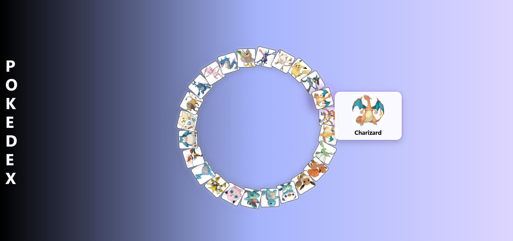

# Pokémon Dial UI

A fun, interactive user interface inspired by a spinning Pokédex dial that showcases various Pokémon. Each Pokémon is displayed on a rotating dial, with hover and animation effects for enhanced engagement.

## Preview

  

## Features

- Rotating circular dial using Tailwind CSS animations
- Each Pokémon is represented by a card with image, name, and types
- Smooth hover effects and visual transitions
- Responsive design (adjusts to different screen sizes)
- Customizable design with easy-to-edit data

## Technologies Used

- HTML5
- [Tailwind CSS](https://tailwindcss.com/) – for utility-first styling
- JavaScript –  interactivity is added

## Setup Instructions

1. Clone or download the repository.
2. Open index.html in your browser.
3. Enjoy the spinning Pokémon dial!

## How It Works

- The main dial is built using a parent div with rotating animation.
- Each Pokémon is a card positioned in a circular layout using CSS transform and rotate.
- Tailwind utility classes manage the layout, animation, and styling.

## Customization

- Add or remove Pokémon cards by editing the HTML.
- Modify styles in tailwind.config.js or by overriding classes in custom CSS.
- Add JavaScript to enhance interactivity (e.g., show Pokémon info on click).

## Credits

- Pokémon images sourced from [Pokémon API/Sprites](https://pokeapi.co/)
- Inspired by Pokédex UI designs

## License

This project is for educational purposes only.
## Author

This project was created by [Siddharth Sahai] and [Anmol Singh] as part of the Web Development assignment
